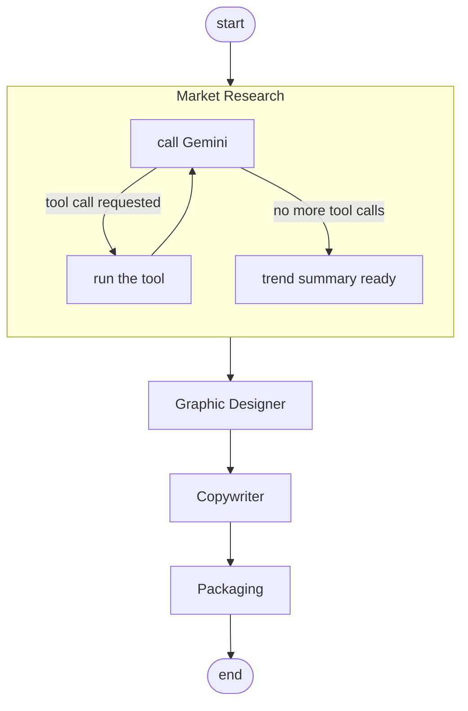

**Multi Agent Market Research**

Multi Agent Market Research produces a trend analysis for a product category. The user picks a category, such as sunglasses, watches, or T-Shirts, and the system researches which products in that category are currently popular or trending, matches them against the catalog, and generates a campaign image, a marketing quote, and an executive report from that research.

Four agents handle these steps. One researches trends through web search and a catalog lookup, another generates a campaign image from that research, another writes the marketing quote, and another assembles the executive report.

The result is a clear picture of the current trend and a ready to review marketing campaign for that product.

Below is an actual generated image and report excerpt, from a real run for the Sunglasses category.


```
GRFISIA Square Oversized Sunglasses, item B093143CRQ
Strategic fit, captures the runway driven demand for bold, face framing
proportion and modern flat top design.

Campaign quote
Bold silhouettes, timeless attitude. Define your edge today.
```

The pipeline is built with LangGraph (https://github.com/langchain-ai/langgraph), with the agents, tool calls, and loop shown below defined as explicit steps in that graph, and uses Google Gemini for text reasoning, Hugging Face for image generation, and Tavily for live web search.

**Contents**

1. How it works
2. Setup
3. The product catalog
4. Usage
5. Project structure

**How it works**

Four agents run in sequence, each reading from and writing to a shared pipeline state. The diagram is the actual LangGraph structure, including the loop inside the first agent.



1. Market Research calls Gemini, and if Gemini requests a tool, such as a web search through Tavily or a catalog lookup, the agent runs it, sends Gemini the result, and calls Gemini again. This repeats until Gemini returns a trend summary instead of another tool request, a pattern commonly called ReAct.
2. Graphic Designer turns the trend summary into an image prompt and caption, then generates the campaign image with Hugging Face and FLUX.1 schnell.
3. Copywriter uses the generated image and trend summary together to write a short campaign quote with a justification.
4. Packaging rewrites the trend summary for an executive audience and assembles everything into a markdown report.

**Setup**

Requires Python 3.11 or newer and API keys for Google Gemini, Tavily, and Hugging Face. Dependencies are managed with uv, available at https://docs.astral.sh/uv/getting-started/installation/, or substitute pip install for uv pip install below.

```bash
uv venv
source .venv/bin/activate
uv pip install -e .
```

Create a file named .env in the project root with the following three keys.

```env
GOOGLE_API_KEY=your-gemini-developer-api-key
TAVILY_API_KEY=your-tavily-api-key
HF_TOKEN=your-huggingface-token
```

The Gemini key is a plain Gemini Developer API key from Google AI Studio at https://aistudio.google.com/, not a Vertex AI service account credential. Get a Tavily key at https://tavily.com/ and a Hugging Face token, with Inference API access, at https://huggingface.co/settings/tokens.

**The product catalog**

Product data is sourced from McAuley-Lab/Amazon-Reviews-2023 on Hugging Face (https://huggingface.co/datasets/McAuley-Lab/Amazon-Reviews-2023). Categories come directly from each product's own category data. 

```bash
curl -L -o data/raw/meta_Clothing_Shoes_and_Jewelry.jsonl \
  "https://huggingface.co/datasets/McAuley-Lab/Amazon-Reviews-2023/resolve/main/raw/meta_categories/meta_Clothing_Shoes_and_Jewelry.jsonl"
```


**Usage**

```bash
market-research
market-research --skip-image    # faster iteration
```

**Project structure**

```
src/market_research/
├── config.py              environment variables, model constants, and paths
├── state.py               PipelineState, the shared state passed between graph nodes
├── llm.py                 every Gemini call in the project goes through this module
├── catalog_builder.py     builds and caches the product catalog on demand from raw data
├── tools/
│   ├── catalog.py         the product catalog tool available to the research agent
│   ├── search.py          the Tavily web search tool available to the research agent
│   └── __init__.py        registry of available tools
├── image_gen/
│   └── hf_image.py        Hugging Face image generation
├── agents/
│   ├── market_research.py    the ReAct style tool calling research agent
│   ├── graphic_designer.py   produces the image prompt, caption, and generated image
│   ├── copywriter.py         produces the campaign quote from the image and trend summary
│   └── packaging.py          produces the final markdown executive report
├── graph.py               wires the four agents into one LangGraph pipeline
└── cli.py                 the command line entry point

data/
├── catalog.csv            the curated product catalog, committed (6,200 rows across 31 categories)
├── category_index.json    a generated cache of available categories, not committed
└── raw/                   the raw dataset and per category pools, not committed, roughly 24 gigabytes

study/                     an earlier prototype, kept only as reference and not used by src/
```

